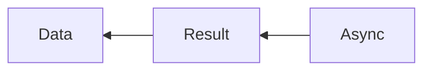

# Hello, caqti-async!

Let's have a look at `Caqti`'s `async` module.

Same as before, we'll have to cross 2 contexts:




While we could define a `let operator`, as we did with `lwt`:

```
let ( let* ) t f = Async.Deferred.bind t ~f
```

`async` actually comes with 2 builtin syntaxes:

 - "ppx" let-bindings
 - operators

> A ppx basically is OCaml's way to do meta-programming.

So instead we will use this syntax:

```ocaml
let future_work : (int, 'a) Deferred.Result.t =
  let open Async.Deferred.Result.Let_syntax in
  let%bind number = Deferred.return (Ok 1) in
  Deferred.return (Ok number)
```

Or this syntax:

```ocaml
let future_work' : (int, 'a) Deferred.Result.t =
  let open Async in
  Deferred.return (Ok 1) >>=? fun number ->
  Deferred.return (Ok number)
```

An important pattern to remember is that `map` = `bind` + `return`, so we can simplify this further:

```ocaml
let future_work : (int, 'a) Deferred.Result.t =
  let open Async.Deferred.Result.Let_syntax in
  let%map number = Deferred.return (Ok 1) in
  number

let future_work' : (int, 'a) Deferred.Result.t =
  let open Async in
  Deferred.return (Ok 1) >>|? fun number -> number
```

See the tests for more details.

```
cd ./04-hello-caqti-async
PGHOST=localhost PGDATABASE=caqti_study PGPORT=5433 dune exec ./bin/main.exe
PGHOST=localhost PGDATABASE=caqti_study PGPORT=5433 dune dune runtest --watch
```

```
$ PGHOST=localhost PGDATABASE=caqti_study PGPORT=5433 dune utop
utop # open Repo;;
utop # let conn = Init.connect_exn ();;
val conn : (module Caqti_async.CONNECTION) = <module>
utop # Exec.add conn 1 2;;
- : (int, [> Caqti_error.call_or_retrieve ]) result = Ok 3
```