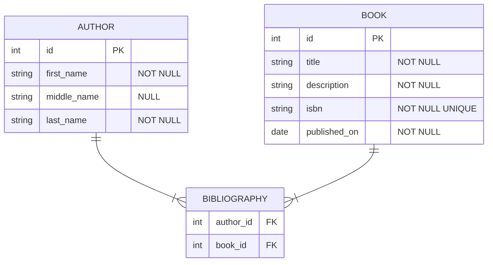

This repository contains OCaml examples using the [Caqti][] library.  It is
meant to be checked out and used for learning.

This is currently work in progress.

[Caqti]: https://github.com/paurkedal/ocaml-caqti/

---

## What we will be building

We will learn to handle this mildly complex relation with `Caqti` and `PostgreSQL`:

- an author can publish one or many books
- a book can be written by one or many authors

We will also:

- interact with the system via the `utop` REPL
- run a binary that will generate and display CRUD queries
- implement tests to ensure we always have a working system
- explain general OCaml-specific concepts along the way
  - the goal is to give a friendly introduction to an OCaml beginner
  - but we expect you to already be a programmer
  - we expect you to know SQL

## Goals

- learn to use `caqti` with a single connection (no concurrency)
- learn to use `caqti` with [lwt](https://github.com/ocsigen/lwt)
- learn to use `caqti` with [async](https://github.com/janestreet/async)
- learn to use `caqti` with [eio](https://github.com/ocaml-multicore/eio)
- learn to use the satellite project [ppx_rapper](https://github.com/roddyyaga/ppx_rapper), which can be interesting from the perspective of reducing boilerplate