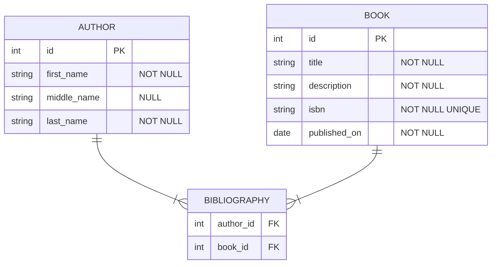

This repository contains OCaml examples using the [Caqti][] library.  It is
meant to be checked out and used for learning.

This is currently work in progress.

NOTE: a reading order is suggested below. One of the objectives of this directed study is to take an OCaml beginner from zero to hero, to quickly get a feel of what it's like to work with a database and OCaml. More experienced may want to skip certain sections obviously.

[Caqti]: https://github.com/paurkedal/ocaml-caqti/

---

## What we will be building

We will learn to handle this mildly complex relationship with `Caqti` and `PostgreSQL`:



- an author can publish one or many books
- a book can be written by one or many authors


## General overview

We will also:

- interact with the system via the `utop` REPL
- run a binary that will call into a lib to generate (and display) CRUD queries
- implement tests to ensure we always have a working system
- explain general OCaml-specific concepts along the way
  - the goal is to give a friendly introduction to an OCaml beginner
  - but we expect you to already be a programmer
  - we expect you to know SQL


## Goals

- learn to use `caqti` with a single connection (no concurrency)
- learn to use `caqti` with [lwt](https://github.com/ocsigen/lwt)
- learn to use `caqti` with [async](https://github.com/janestreet/async)
- learn to use `caqti` with [eio](https://github.com/ocaml-multicore/eio)
- learn to use the satellite project [ppx_rapper](https://github.com/roddyyaga/ppx_rapper), which can be interesting from the perspective of reducing boilerplate

## Prerequisites

- PostgreSQL server

  See [Database setup](#database-setup)

- Postgresql development libraries

  These can be found in `libpq-dev` on Debian-based systems, `libpq-devel` on Fedora and `postgresql-libs` on Arch

- Caqti and ppx_rapper

  These can be installed via `opam install . --deps-only`, and will require OCaml 5 for the Eio examples. If you're on a lower version, you'll have to install the required packages from dev.opam manually.

Also, you may run the following command to install the dependencies:

```
# Or install packages manually, see: dev.opam
opam install . --deps-only
```

## Database setup

As long as you have a "standard" postgreSQL installation, you should be able to easily run a **local** database on port 5433

- make db-init
- make db-start
- make db-create
- make db-psql
  - or just use: `PGHOST=localhost PGDATABASE=caqti_study PGPORT=5433 psql`

Also check these commands:

- make db-status
- make db-reset

## Running all the tests

To double-check you're all set, you may want to run the project's test suite with:

```
PGHOST=localhost PGDATABASE=caqti_study PGPORT=5433 dune build

# We run the tests in a single thread currently, see: issues/9.
PGHOST=localhost PGDATABASE=caqti_study PGPORT=5433 dune runtest -j1
```

Running and adding more tests is also a good way to make improvements to this repo if you feel like contributing.

## Suggested reading order

- [Hello World: setup a basic OCaml project](study/hello-world)
- [Hello Tests: learn how to test](study/hello-tests)
- [Hello Caqti (blocking)](study/hello-caqti-blocking)
- [Hello Caqti Lwt (promises)](study/hello-caqti-lwt)
- [Hello Caqti Async (promises, another flavor)](study/hello-caqti-async)
- [Create a CLI app with Caqti/Lwt](study/lwt-cli-app)
- [Hello Ppx_rapper(code-gen to reduce boilerplate)](study/hello-ppx_rapper)
