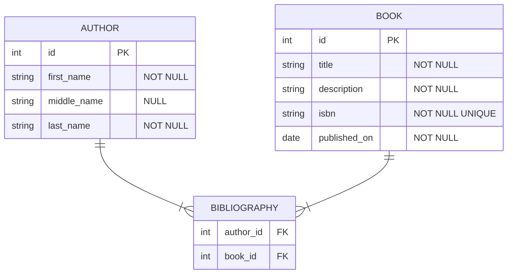

# Getting Started

Welcome to the Caqti study!

## What we will be building

We will learn to handle this mildly complex relationship with `Caqti` and `PostgreSQL`:

- an author can publish one or many books
- a book can be written by one or many authors
