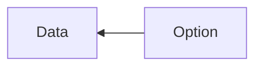
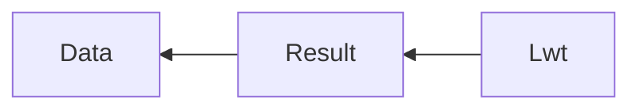

# Hello, caqti-lwt!

Now, we will talk to our database again with `caqti`, but in an asynchronous fashion via its `lwt` module.

Remember those monads?

Whereas before we could "extract" the data out of the `Option` type (which can be seen like a wrapper type), like so:



Now, we will have to do the same, but we will have to "cross" 2 contexts to successfully extract our data, like so:



To make things easier to write and read, we will again use a "let operator", like so:

```ocaml
let ( let* ) = Lwt_result.bind
```

This will allow us to successfully "cross" the 2 "monad" contexts, in one line of code (or short-circuit to a failure state).

```
cd ./03-hello-caqti-lwt
PGHOST=localhost PGDATABASE=caqti_study PGPORT=5433 dune exec ./bin/main.exe
PGHOST=localhost PGDATABASE=caqti_study PGPORT=5433 dune runtest --watch
```

## Test via the REPL

NOTE: `utop` can resolve promises automagically. Rather than using the `resolve_ok_exn` helper, try to evaluate only the promise at the prompt.

```
$ PGHOST=localhost PGDATABASE=caqti_study PGPORT=5433 dune utop
```

```ocaml
# open Repo;;
# let conn = Init.connect_exn ();;
val conn : (module Caqti_lwt.CONNECTION) = <module>
# let promise = Exec.add conn 1 2;;
val promise : (int, [> Caqti_error.call_or_retrieve ]) result Lwt.t = <abstr>
# Repo.Exec.resolve_ok_exn promise;;
- : int = 3
```
